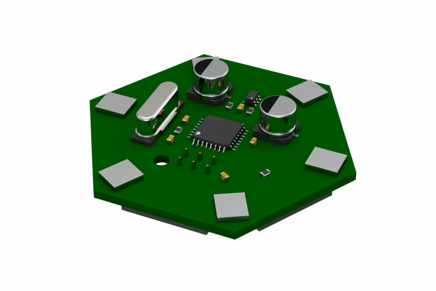
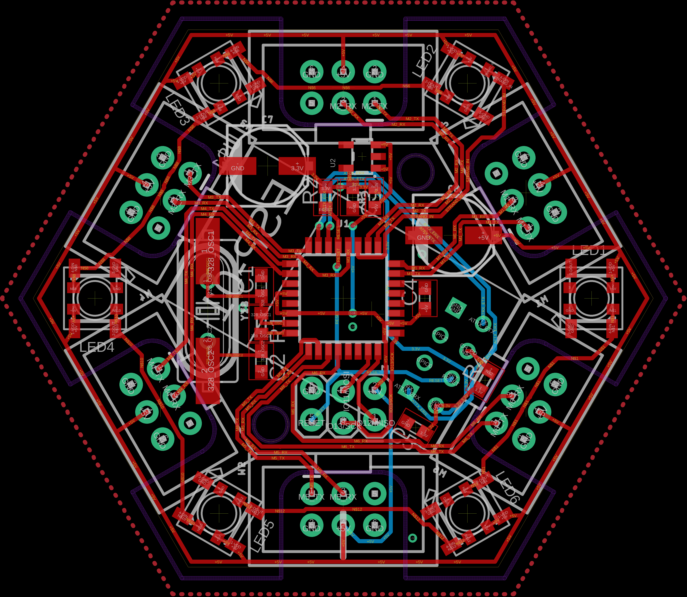
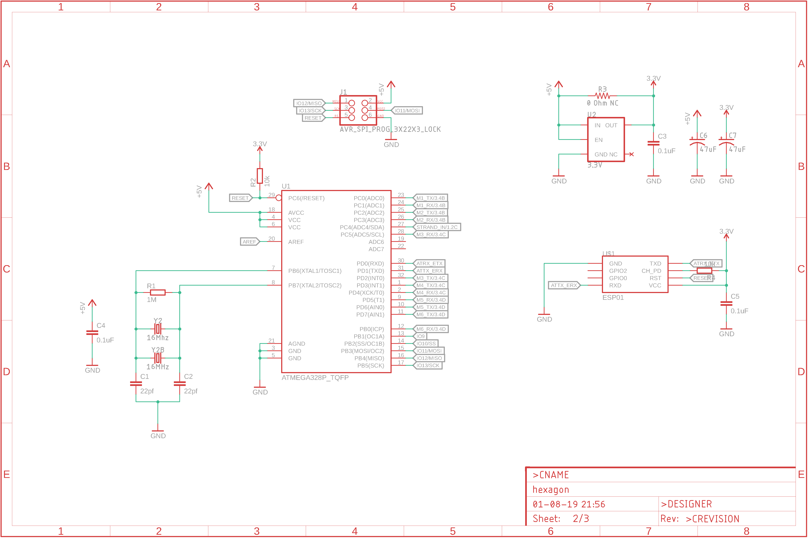
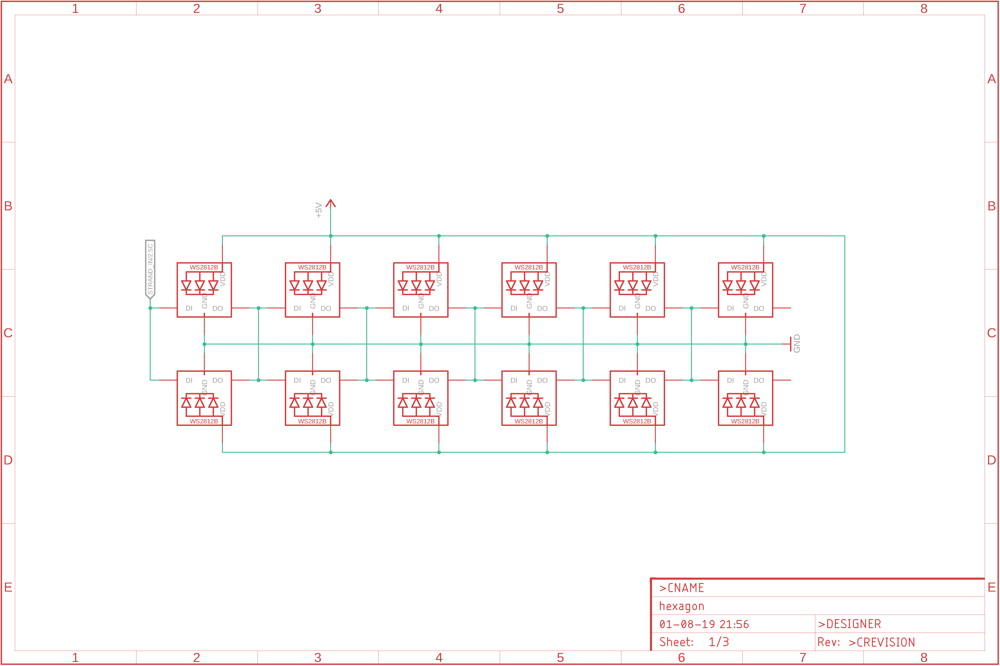
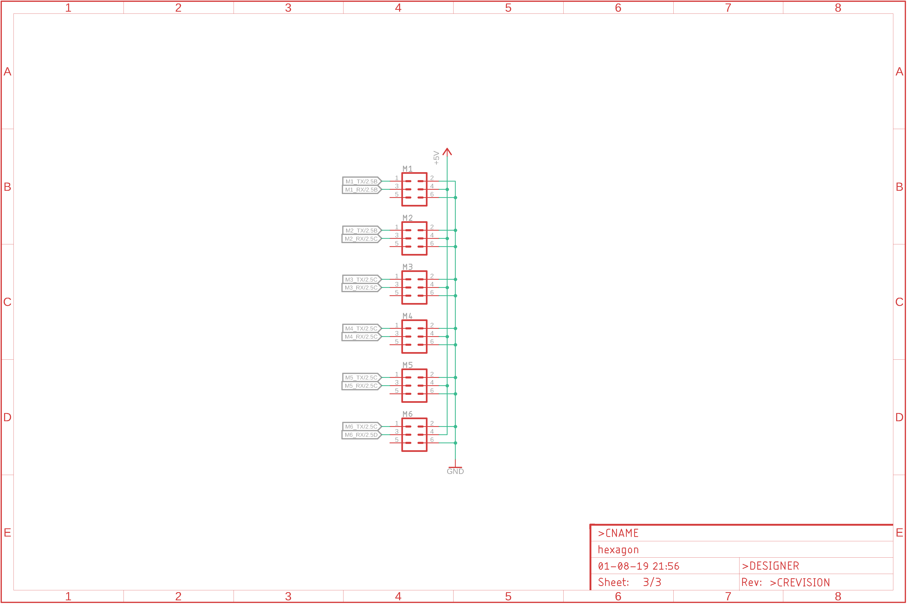

Hexagon LED
===========

##Objective:

Build a small, inexpensive hexagonal lighting PCB with an inexpensive microcontroller that can communicate using slow-speed software serial
 with the other attached nodes and to an optionally fitted ESP8266 ESP-01 module which will designate itself the "host", 
 and populate out colour information from the center.
 
A serial mesh of communication between each interlinked hexagonal node.

A REST service running on the ESP sat on the users Wifi allowing for colour information to be pushed from an app or script.

## Render

## Board

Not shown: Groundplane fill. Represented by area inside red dashed octagon

Purple outline: Lasercut rear plastic panel to insert into the back of a 3d printed housing.

Illustration shows shielded 3x2 keyed connectors, not necessarily fitted.

## Schematic
### Microcontroller

### Microcontroller

### Microcontroller

## License
This project is licensed under the The TAPR Open Hardware License.

